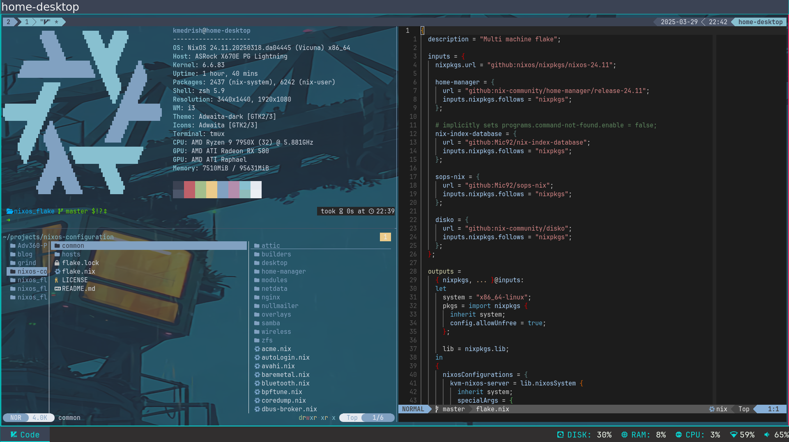
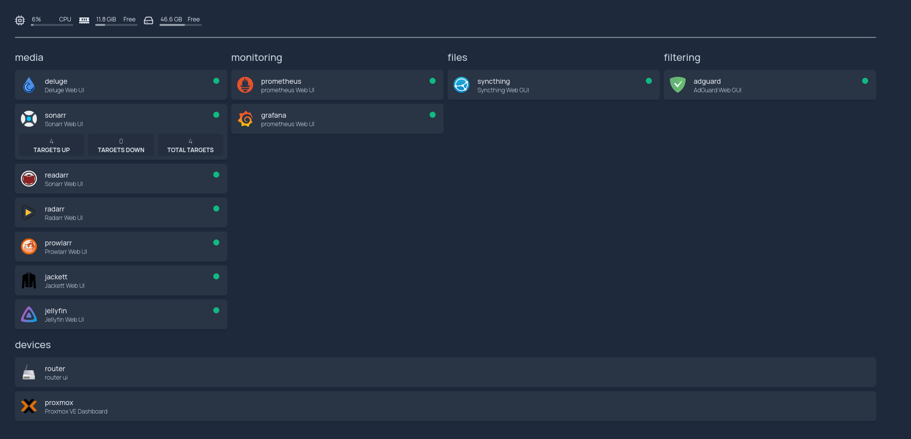

# Desktop & Homelab Configurations Based on NixOS and Home-Manager Flake

Personal [NixOS] configurations utilizing [home-manager] both as an integrated OS module and
standalone for generic GNU/Linux systems, structured using a flake. This repository contains
configuration files tailored specifically to manage my desktop environments and dedicated homelab
infrastructure. It aims to simplify and automate deployment and maintenance, streamlining
operations across my desktops and homelab.

> [!IMPORTANT]
> Since I'm employing [sops-nix] for secret management (such as user password)
> within this repository, complete deployment is not feasible without the necessary
> encryption key. Consequently, certain configurations will not function properly.
>
> Use this repository as a blueprint for setting up your own system. The individual
> configuration files (such as tmux, neovim, etc.) can serve as a reference.
>
> If you still thinking using the repository "as is" then you will need to remove the
> high level sops file(sops-configuration.nix) from the import list and editing the
> password for the prime user.

# Overall Design Philosophy
- Multiple machines are defined with emphasis on shared code between them
in order to achieve consistency and to avoid code repeat where possible. With
each machine having its own separate responsibility.
- Work flow is heavily skewed towards the use of the keyboard and the terminal.
Some keyboard bindings may look strange but they are effected by the fact
that I am using a programmable keyboard(configurations in
[my Adv360-Pro-ZMK repo]).
- Lacking functionality is extended by scripts(such as buku bookmarks for rofi).
- Effort has been made to define everything using nix, including the $HOME
dotfiles to the possible extent.

# Highlights
- Multiple machines configurations using [home-manager] as a NixOS module, allowing for
  shared configurations across systems, with an option for standalone home-manager
  configurations to be used on generic Linux machines, such as Ubuntu.
- Secrets deployment using [sops-nix]. Handling secrets on OS level and on home-manger level.
- Extensively configured xorg and terminal environment.
- Configuration for KVM, VirtualBox, and docker.
- Integration of [disko] to partition hard drives during NixOS installing
  and to create /etc/fstab.
- Some of the machines use zfs.

# My Desktops

## Daily Driver Software
- **Desktop**: xorg with i3 and polybar.
- **Launcher**: Rofi.
- **Shell**: zsh + starship with fzf, zoxide and atuin integration.
- **Editor**: neovim.
- **Terminal**: alacritty(with tmux).
- **Second brain**: emacs(org-roam).

## Some of the Daemons I Use
- **ssh-agnet(via gpg-agnet)**: For all my ssh needs.
- **emacs daemon**: for quick load time.
- **clipmenu**: a clipboard history via rofi.
- **redshift**: Adjusts the color temperature of your screen according to your surroundings.
- **dnust**: notification daemon.
- **sxhkd**: A simple X hotkey daemon.
- **syncthing**: sync files between all of my machines.
- **tmux**: Used to start tmux on boot and with the resurrect and continuum
            plugins my entire terminal environment is always ready for me.
- **watchman**: Used to watch a directory and on any change in it to trigger actions.
  I used it to rsync files I changed locally to a remote automatically.
- **moolticuted**: a daemon used to interact with mooltipass the hardware password manager.

# Homelab

# Repo Structure
- **flake.nix**: The entry point for machines and home configurations.
- **machines**: The machines that can be configured using this repository. With each
machine having its high level .nix configuration that define machine specific settings
and include code that can be shared with other machines.
- **modules**: Divided into modules to be used by home-manger(including user scripts)
to mange user configuration and into nixos modules which are mostly configurations
I found in /etc/nixos/configuration.nix and refactored into responsibilities that can
then be including by the various machines to achieve code reuse.
- **wallpaper**: self explanatory :)

# ToDo
- [ ] I am not sure that emacs systemd unit can communicate with ssh-agnet, this is a very low
      priority.
- [ ] Look into automating home-manger installation as a stand alone on
      generic Linux using Ansible.

<!-- variables -->
[NixOS]: <https://nixos.org>
[home-manager]: <https://github.com/nix-community/home-manager/>
[my Adv360-Pro-ZMK repo]: <https://github.com/p3t33/Adv360-Pro-ZMK/tree/V3.0/>
[disko]: <https://github.com/nix-community/disko>
[sops-nix]: <https://github.com/Mic92/sops-nix>
[nixos-anywhere]: <https://github.com/nix-community/nixos-anywhere>
