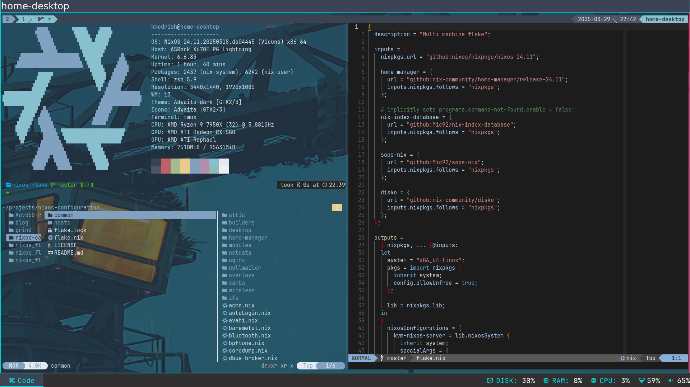
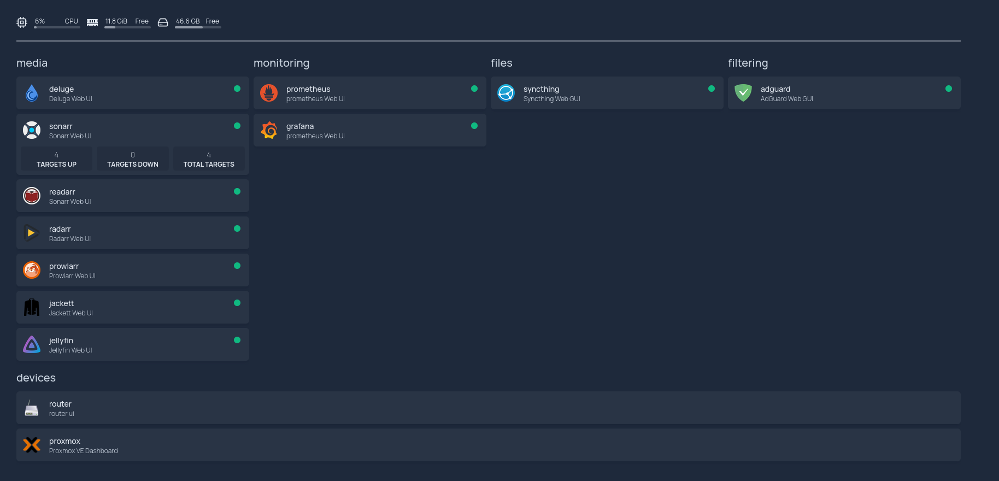

# Desktop & Homelab Configurations Based on NixOS and Home-Manager Flake

Personal [NixOS] configurations utilizing [home-manager] both as an integrated OS module and
standalone for generic GNU/Linux systems, structured using a flake. This repository contains
configuration files tailored specifically to manage my desktop environments and dedicated homelab
infrastructure. It aims to simplify and automate deployment and maintenance, streamlining
operations across my desktops and homelab.


> [!IMPORTANT]
> Since I'm employing [sops-nix] for secret management (such as user password)
> within this repository, complete deployment is not feasible without the necessary
> encryption key. Consequently, certain configurations will not function properly.
>
> Use this repository as a blueprint for setting up your own system. The individual
> configuration files (such as tmux, neovim, etc.) can serve as a reference.
>
> If you still thinking using the repository "as is" then you will need to remove the
> high level sops file(sops-configuration.nix) from the import list and editing the
> password for the prime user.

# Design Philosophy
- All machines are configured with an emphasis on **code reuse** and **clear responsibility separation**.
  Shared components are factored into reusable modules to reduce duplication and enforce consistency.
- Modular "Import-All-and-Enable" Pattern:
  - All low level NixOS and Home-Manager modules are always imported by all machines, but only enabled
  conditionally using module or profile level option.
- Modular "Import-All-and-Enable" Pattern:
  All low-level NixOS and Home-Manager modules are always imported, but only conditionally
  enabled using module level option. These options can be toggled at the module or profile
  level (e.g., `desktop`, `server`, `gaming`). This design promotes:
  - Clear **separation of concerns** between module implementation and activation.
  - Centralized profile definitions to **enable groups of modules with a single switch**, creating a single source of truth for machines
  to use.
  Each directory of low-level modules has a `default.nix` that exposes both individual and grouped profile options.
  This ensures that machines using the same profile stay consistent and automatically benefit from future improvements
  to shared modules.
- Work flow is heavily skewed towards the use of the keyboard and the terminal.
Some keyboard bindings may look strange but they are effected by the fact
that I am using a programmable keyboard(configurations in
[my Adv360-Pro-ZMK repo]).
- Lacking functionality is extended by scripts(such as buku bookmarks for rofi).
- Effort has been made to define everything using nix, including the $HOME
dotfiles to the possible extent.

# Highlights
- **Multiple machines support** using [home-manager] as a NixOS module, allowing for
  shared configurations across systems, with an option for standalone home-manager
  configurations to be used on generic Linux machines, such as Ubuntu.
- **"Import-All-and-Enable" module system**, allowing for shared low-level modules across machines,
  selectively activated through module or profile level enable options.
- **Secrets management** using [sops-nix]. Handling secrets on OS level and on home-manger level.
- **Fully declarative graphical environment**, including finely tuned Xorg, i3, polybar.
- **Extensive terminal-first tooling**, featuring zsh + starship, tmux, fzf, zoxide, and more.
- **Virtualization-ready**, with configuration for KVM, and Docker environments.
- **Disk provisioning** powered by [disko], automating partitioning and `fstab` generation during NixOS installation.
  and to create /etc/fstab.
- Some of the machines use zfs.


# Design implementation
## The repository consist of:
``` bash
├── flake.nix
├── machines
├── modules
├── wallpaper

```
- **flake.nix**: Is the entry point for machines configurations.
- **machines**: The machines that can be configured using this repository. With each
machine having its high level .nix configuration that define machine specific settings
and include code that can be shared with other machines.
- **modules**: Divided into modules to be used by home-manger(including user scripts)
to mange user configuration and into nixos modules which are mostly configurations
I found in /etc/nixos/configuration.nix and refactored into responsibilities that can
then be including by the various machines to achieve code reuse.
- **wallpaper**: self explanatory :)


## Putting together a machine
There are 3 main levels of abstraction when it comes to configuration files,
At the very bottom there are the individual module files, those are the basic building
blocks of the system, they include nixos/home-manger modules. And most of them
encapsulated inside of mkIf option, E.g sshd.nix

```nix
{ config, lib, ... }:

let
  cfg = config.customOptions.enableModule.sshd;
in
{
  options.customOptions.enableModule.sshd =
    lib.mkEnableOption "Enable OpenSSH service";

  config = lib.mkIf cfg {
    services.openssh = {
      enable = true;
      settings = {
        PasswordAuthentication = false;
      };
    };
  };
}
```

At the root directory of each category of such modules(E.g nixos_flake/modules/nixos) exist the
intermediate aggregate file default.nix. This file import all of the low level module files
and creates intermediate mkIf option that aggregate multiple low level module mkIf options into
profiles(core, securityKeys, ...).

```nix
{ config, lib, ... }:

let
  g = config.customOptions.enableConfigurationProfile;
in
{
  imports = [
  ./system_packages/cli_utilities.nix
  ./system_packages/development.nix
  ./system_packages/encryption.nix

  ./security/nitrokey.nix
  ./security/solokey2.nix

  ];

    options.customOptions.enableConfigurationProfile = lib.mkOption {
      type = lib.types.attrsOf lib.types.bool;
      default = {};
      description = "Enable system profiles like 'desktop', 'server', 'securityKeys', etc.";
    };

     config.customOptions.enableModule = lib.mkMerge [

    # Core profile enables CLI, dev, encryption
    (lib.mkIf (g.core or false) {
      development  = true;
      cliUtilities = true;
      encryption   = true;
    })

    # Security keys (Nitrokey, SoloKey)
    (lib.mkIf (g.securityKeys or false) {
      nitrokey = true;
      solokey2 = true;
    })

  ];
}
```

And finally there are the high level configuration files(E.g work-pc)
``` bash
work-pc
├── configuration.nix
├── disko-configuration.nix
├── hardware-configuration.nix
├── home.nix
├── secrets
│   ├── home-manager
│   │   └── secrets.yaml
│   └── nixos
│       └── secrets.yaml
├── services-configuration.nix
├── sops-configuration.nix
└── sops-home.nix
```


Each such file has three responsibilities:
- To import the corresponding default file(E.g services-configuration will be importing
nixos_flake/modules/nixos/services).
- To enable the desired functionality using the profile level abstraction(defined in default.nix)
or to use the low level module abstraction.
- To override the options provided by the low level modules it is importing via default.nix.

```nix
customOptions = {
  syncthing = {
    user = "syncthing";

  enableServicesProfile = {
    core = true;
  };

  enableModule = {
    syncthing = true;
  };
};
```

configuration.nix plays additional role in the form of being the highest entry point for the machine
that is being defined, it is responsible to import all of the other high level configuration files.

```nix
imports = [
  ./hardware-configuration.nix
  ./services-configuration.nix
  ./global-options.nix
  ./sops-configuration.nix
  ./disko-configuration.nix
  ./disko-configuration-extra-hard-dirves.nix
  ../../modules/nixos # imported via default.nix
];

```

# My Desktops

## Daily Driver Software
- **Desktop**: xorg with i3 and polybar.
- **Launcher**: Rofi.
- **Shell**: zsh + starship with fzf, zoxide and atuin integration.
- **Editor**: neovim.
- **Terminal**: alacritty(with tmux).
- **Second brain**: emacs(org-roam).

## Some of the Daemons I Use
- **ssh-agnet(via gpg-agnet)**: For all my ssh needs.
- **emacs daemon**: for quick load time.
- **clipmenu**: a clipboard history via rofi.
- **redshift**: Adjusts the color temperature of your screen according to your surroundings.
- **dnust**: notification daemon.
- **sxhkd**: A simple X hotkey daemon.
- **syncthing**: sync files between all of my machines.
- **tmux**: Used to start tmux on boot and with the resurrect and continuum
            plugins my entire terminal environment is always ready for me.
- **watchman**: Used to watch a directory and on any change in it to trigger actions.
  I used it to rsync files I changed locally to a remote automatically.
- **moolticuted**: a daemon used to interact with mooltipass the hardware password manager.

# Homelab



# ToDo
- [ ] I am not sure that emacs systemd unit can communicate with ssh-agnet, this is a very low
      priority.
- [ ] Look into automating home-manger installation as a stand alone on
      generic Linux using Ansible.

<!-- variables -->
[NixOS]: <https://nixos.org>
[home-manager]: <https://github.com/nix-community/home-manager/>
[my Adv360-Pro-ZMK repo]: <https://github.com/p3t33/Adv360-Pro-ZMK/tree/V3.0/>
[disko]: <https://github.com/nix-community/disko>
[sops-nix]: <https://github.com/Mic92/sops-nix>
[nixos-anywhere]: <https://github.com/nix-community/nixos-anywhere>
